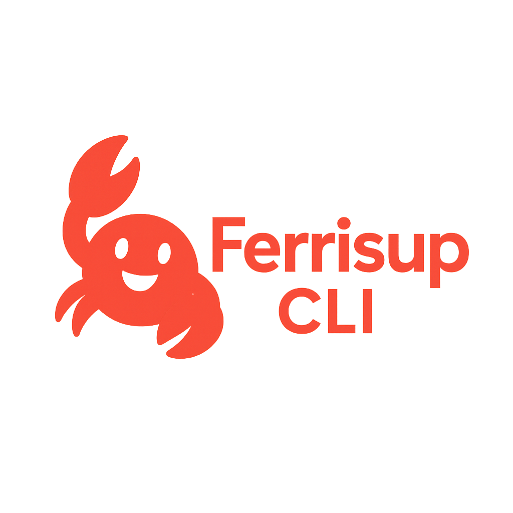

# FerrisUp CLI

A powerful Rust project bootstrapping tool - Start Anywhere, Scale Anywhere

> **Note:** FerrisUp is under active development. While the core templates are fully functional, some advanced features described in this README are still in development and will be included in upcoming versions.

## Overview

FerrisUp CLI is a versatile command-line tool for creating and managing Rust projects with flexible templates. Like Create React App for React, FerrisUp makes it easy to start new Rust projects with the right structure and dependencies.

## Features

- **Multiple Templates**: From minimal binaries to full-stack applications
- **Transform Capability**: Start with a simple project and scale as you grow
- **GenAI Integration**: Ready-made AI model templates
- **Edge Computing**: WebAssembly and serverless-ready templates
- **Embedded Systems**: Support for RP2040, ESP32, STM32, and Arduino
- **Interactive CLI**: User-friendly command interface

## Installation

```bash
# Install from crates.io
cargo install ferrisup

# Or install from source
git clone https://github.com/Jitpomi/ferrisup.git
cd ferrisup
cargo install --path .
```

## Quick Start

```bash
# Create a new minimal project
ferrisup new my_project

# Create a full-stack project
ferrisup new my_fullstack --template=full-stack

# Create an AI project
ferrisup new my_ai_app --template=gen-ai

# Create an edge computing project
ferrisup new my_edge_app --template=edge-app

# Create an embedded systems project
ferrisup new my_embedded --template=embedded
```

## Available Templates

View all available templates:

```bash
ferrisup list
```

Current templates include:
- `minimal` - Simple binary with a single main.rs file
- `library` - Rust library crate with a lib.rs file
- `embedded` - Embedded systems firmware for microcontrollers
- `server` - Web server with API endpoints (Axum, Actix, or Poem)
- `client` - Frontend web application (Leptos, Yew, or Dioxus)
- `serverless` - Serverless function (AWS Lambda, Cloudflare Workers, etc.)
- `data-science` - Data science and machine learning projects
- `edge` - Edge computing applications (Cloudflare, Vercel, Fastly, AWS, etc.)

## Usage

```bash
ferrisup [OPTIONS]
```

### Commands

FerrisUp offers a variety of commands to help you bootstrap, transform, and manage your Rust projects:

### `new`

Create a new Rust project with a predefined structure.

```bash
ferrisup new [PROJECT_NAME] [--template TEMPLATE_NAME] [--git] [--build] [--no-interactive]
```

- `PROJECT_NAME`: Optional name for your project
- `--template`: Specify a template (web, api, full-stack, etc.)
- `--git`: Initialize a git repository
- `--build`: Run cargo build after creation
- `--no-interactive`: Create project without prompting, using default values

### `transform`

Transform an existing project into a FerrisUp template structure.

```bash
ferrisup transform [--project PATH] [--template TEMPLATE_NAME]
```

- `--project`: Path to existing project
- `--template`: Template to transform to

### `list`

List available templates.

```bash
ferrisup list
```

### `scale`

> **Coming Soon:** Enterprise scaling features are planned for future releases.

Interactively scale a project with custom components.

```bash
ferrisup scale
```

### `preview`

Preview a template without creating any files.

```bash
ferrisup preview [--template TEMPLATE_NAME]
```

- `--template`: Template to preview

### `component`

> **Coming Soon:** Advanced component management is planned for future releases.

Manage project components (add/remove).

```bash
ferrisup component [--action ACTION] [--component-type TYPE] [--project PATH]
```

- `--action`: Action to perform: add, remove, or list
- `--component-type`: Component type: client, server, database, ai, edge, embedded, etc.
- `--project`: Path to the project

### `config`

Manage configurations (export/import).

```bash
ferrisup config [--export] [--import FILE] [--path PATH]
```

- `--export`: Export current configuration to a file
- `--import`: Import configuration from a file
- `--path`: Path to export/import configuration

### `workspace`

Manage Cargo workspaces.

```bash
ferrisup workspace [--action ACTION] [--path PATH]
```

- `--action`: Action to perform: init, add, remove, list, or optimize
- `--path`: Path to the workspace

### `dependency`

> **In Development:** Dependency management features are currently in development. Basic functionality is available, but advanced features are planned for future releases.

Manage project dependencies with smart features.

```bash
ferrisup dependency [SUBCOMMAND]
```

#### Subcommands:

##### `add`

Add dependencies to your project with smart feature suggestions.

```bash
ferrisup dependency add [DEPENDENCIES...] [--dev] [--features FEATURES] [--version VERSION] [--path PATH]
```

- `DEPENDENCIES`: Dependencies to add (e.g., serde, tokio)
- `--dev`: Add as development dependency
- `--features`: Add with specific features (comma separated)
- `--version`: Add with specific version
- `--path`: Path to the project (defaults to current directory)

##### `remove`

Remove dependencies from your project.

```bash
ferrisup dependency remove [DEPENDENCIES...] [--path PATH]
```

- `DEPENDENCIES`: Dependencies to remove (if not specified, will show an interactive selection)
- `--path`: Path to the project (defaults to current directory)

##### `update`

Update dependencies in your project.

```bash
ferrisup dependency update [DEPENDENCIES...] [--path PATH]
```

- `DEPENDENCIES`: Dependencies to update (if not specified, will update all)
- `--path`: Path to the project (defaults to current directory)

##### `analyze`

Analyze dependencies in your project for security vulnerabilities and insights.

```bash
ferrisup dependency analyze [--path PATH]
```

- `--path`: Path to the project (defaults to current directory)

### `unused-features`

Find and remove unused features in your Cargo dependencies to optimize your project. This command helps reduce compile times and binary sizes by identifying features that are enabled but not actually used.

```bash
ferrisup unused-features [--path PATH]
```

- `--path`: Path to the project (defaults to current directory)

The command will:
1. Check if the `unused-features` tool is installed (and install it if needed)
2. Analyze your project for unused features in dependencies
3. Display a list of unused features grouped by dependency
4. Provide specific recommendations for removing them from your Cargo.toml

This command identifies features that are enabled in your dependencies but not actually used in your code, helping you reduce compile times and binary sizes.

## Workspace Management

> **Coming Soon:** Comprehensive workspace management capabilities are planned for future releases. The basic functionality is available, but advanced features are still in development.

FerrisUp provides workspace management capabilities through the `workspace` command:

### Initialize a Workspace

```bash
ferrisup workspace --action init
```

This command will:
- Create a Cargo workspace configuration
- Discover existing crates or create new workspace structure
- Set up common dependencies in the workspace

### Add a Crate to Workspace

```bash
ferrisup workspace --action add
```

Add a new crate to your workspace:
- Select crate type (client, server, shared, custom)
- Specify crate name
- Choose between binary or library crate

### Remove a Crate

```bash
ferrisup workspace --action remove
```

Remove a crate from your workspace with the option to:
- Just remove it from workspace members
- Also delete the crate files

### List Workspace Members

```bash
ferrisup workspace --action list
```

Show all workspace members and discovered crates.

### Optimize Workspace

```bash
ferrisup workspace --action optimize
```

Optimize your workspace by:
- Ensuring all crates are included in workspace members
- Adding workspace.dependencies for common dependencies
- Applying best practices for workspace structure

## Development and Testing

FerrisUp includes a comprehensive test suite to ensure functionality and compatibility. You can run the tests with:

```bash
# Run all tests
cargo test

# Run specific test
cargo test test_name

# Run tests in specific file
cargo test --test file_name
```

The `--no-interactive` flag is especially useful for automated testing and CI/CD pipelines, allowing for the creation of projects without requiring user input.

### Template Compatibility

FerrisUp supports both new and old template formats, ensuring backward compatibility with existing templates. The system automatically converts older templates to the newer format.

### Contributing

We welcome and encourage contributions from the community! If you believe in the project and would like to help make FerrisUp even better, please consider contributing.

**How to Contribute:**

1. Fork the repository
2. Create your feature branch: `git checkout -b feature/amazing-feature`
3. Commit your changes: `git commit -m 'Add some amazing feature'`
4. Push to the branch: `git push origin feature/amazing-feature`
5. Open a Pull Request

**Priority Areas for Contribution:**

- Enhancing the `transform` command to fully support project transformation between templates
- Implementing comprehensive `scale` functionality for enterprise deployments
- Expanding the `component` and `workspace` management features
- Improving the dependency management system
- Adding new templates or enhancing existing ones

For major contributions or if you'd like to discuss implementation details before starting work, please email us at dev@jitpomi.com.

## Workflow

FerrisUp follows a simple workflow:

```
┌─────────────────────┐
│  Command Selection  │
│  new, transform,    │
│  scale, list        │
└──────────┬──────────┘
           │
           ▼
┌─────────────────────┐
│  Project Location   │
│  Current dir or     │
│  specified path     │
└──────────┬──────────┘
           │
           ▼
┌─────────────────────┐
│  Template Selection │
│  Choose template or │
│  customize          │
└──────────┬──────────┘
           │
           ▼
┌─────────────────────┐
│ Component Selection │
│ Client, Server,     │
│ Database, etc.      │
└──────────┬──────────┘
           │
           ▼
┌─────────────────────┐
│ Technology Stack    │
│ Framework, language │
│ and tools           │
└──────────┬──────────┘
           │
           ▼
┌─────────────────────┐
│   Configuration     │
│   Git, CI/CD,       │
│   Dependencies      │
└──────────┬──────────┘
           │
           ▼
┌─────────────────────┐
│   Project Created   │
│   or Transformed    │
└─────────────────────┘
```

Each step is optional and can be skipped if you provide the information via command-line parameters. FerrisUp only prompts for what it needs to complete your task.

## Configuration

Configure through JSON or environment variables:

```json
{
  "project_name": "my_rust_app",
  "template": "full-stack",
  "components": {
    "client": {
      "apps": ["web", "mobile"],
      "frameworks": ["dioxus", "tauri"]
    },
    "server": {
      "services": ["api", "auth"],
      "frameworks": ["poem", "axum"]
    },
    "database": {
      "enabled": true,
      "engines": ["postgres", "redis", "neo4j", "milvus"],
      "migration_tool": "sqlx"
    },
    "libs": {
      "modules": ["core", "models", "auth"]
    },
    "binaries": {
      "apps": ["cli", "server", "worker"],
      "types": ["app", "service", "utility"]
    },
    "ai": {
      "models": ["llama", "whisper"],
      "backends": ["candle"],
      "features": ["text-generation", "speech-to-text"]
    },
    "edge": {
      "targets": ["wasm", "cloudflare-workers"],
      "features": ["serverless", "cdn-integration"]
    },
    "embedded": {
      "targets": ["rp2040", "esp32"],
      "features": ["no-std", "real-time", "low-power"]
    }
  },
  "dependencies": {
    "dioxus": { "version": "0.4", "features": ["web"] },
    "poem": { "version": "1.3" },
    "sqlx": { "version": "0.7", "features": ["postgres"] }
  },
  "templates": {
    "full-stack": ["client", "server", "database", "libs"],
    "backend-only": ["server", "database", "libs"],
    "frontend-only": ["client", "libs"],
    "api-service": ["server", "database", "libs"],
    "library": ["libs"],
    "minimal": ["binaries"],
    "hello-world": ["binaries", "libs"],
    "cli-app": ["binaries"],
    "gen-ai": ["ai", "server", "libs"],
    "edge-app": ["edge", "libs"],
    "iot-device": ["embedded", "libs"],
    "ml-pipeline": ["ai", "server", "database", "libs"],
    "serverless": ["server", "database", "libs"],
    "data-science": ["ai", "server", "database", "libs"]
  }
}
```

## Maximum Flexibility: From Hello World to Enterprise Scale

FerrisUp is designed with maximum flexibility in mind, allowing you to:

1. **Start Small**: Begin with a simple hello-world application
2. **Grow Incrementally**: Add components as your needs evolve
3. **Scale Massively**: Deploy to enterprise-grade infrastructure

### Starting from Minimal

Use the `--minimal` flag to create a bare-bones Rust project:

```bash
ferrisup new my_project --minimal
```

This creates a simple "Hello, World!" application with a clean workspace structure that's ready to expand.

### Binary Applications

FerrisUp supports standalone binary applications with the `binaries` component:

```json
"binaries": {
  "apps": ["cli", "server", "worker"],
  "types": ["app", "service", "utility"]
}
```

Perfect for command-line tools, background workers, or microservices.

### Template Selection

FerrisUp offers a variety of templates to match your project needs:

#### Core Templates
- **minimal** - Simple binary with a single main.rs file
- **library** - Rust library crate with a lib.rs file
- **full-stack** - Complete application with client, server, and shared libraries

#### Specialized Templates
- **gen-ai** - AI-focused project with inference and model components
  - LLaMA, BERT, Whisper, and Stable Diffusion integration options
  - Model serving and inference optimization
  
- **edge-app** - WebAssembly-based application for edge computing
  - Cloudflare Workers, Deno Deploy support
  - WASM optimized components
  
- **embedded** - Embedded systems firmware for microcontrollers
  - Support for RP2040, ESP32, STM32, Arduino
  - HAL abstraction and peripheral management
  
- **serverless** - Serverless functions for cloud deployment
  - AWS Lambda, Azure Functions, Google Cloud Functions
  - Local development and testing support
  
- **iot-device** - IoT device firmware with connectivity features
  - MQTT, HTTP, and Bluetooth connectivity
  - Secure boot and OTA update support
  
- **ml-pipeline** - Machine learning data processing pipeline
  - Data ingestion, transformation, and model training
  - Result visualization and export
  
- **data-science** - Data science project with analysis tools
  - Data loading and preprocessing
  - Analysis, visualization, and reporting

All templates can be fully customized during the interactive setup process. You're never locked into any specific technology stack or architecture.

## Enterprise Scaling

When you're ready to scale, use the `--scale` flag to generate deployment configurations:

```bash
ferrisup new my_enterprise_app --scale
```

This adds:

- **Docker configuration**: Optimized multi-stage build
- **Kubernetes manifests**: Deployment, service, and scaling
- **CI/CD pipelines**: GitHub Actions workflows
- **Cloud deployments**: AWS, GCP, Azure, and Digital Ocean templates

## Start Anywhere, Scale Anywhere

FerrisUp truly embodies the "start anywhere, scale anywhere" philosophy with its transformation capability. You can begin with the simplest project and evolve it as your needs grow:

### Transformation

> **In Development:** The transformation feature is currently in active development. Basic transformation capabilities are available, but the full functionality described below is planned for future releases.

```bash
# Start with a minimal project
ferrisup new my_project

# Later transform it to a library
ferrisup transform --project=my_project --template=library

# Add AI capabilities when needed
ferrisup transform --project=my_project --template=gen-ai

# Eventually scale to a full-stack application
ferrisup transform --project=my_project --template=full-stack

# Add enterprise scaling when ready for production
ferrisup scale --project=my_project
```

When fully implemented, this transformation feature will intelligently:
- Convert binaries to libraries when appropriate
- Preserve your existing code
- Add only the components you need
- Update your workspace configuration

## Project Structure

```
project_name/
├── Cargo.toml
├── client/
│   ├── app1/
│   ├── app2/
│   └── common/
├── server/
│   ├── service1/
│   ├── service2/
│   └── common/
├── database/
│   ├── migrations/
│   ├── schema/
│   ├── seeds/
│   └── src/
├── libs/
│   ├── core/
│   ├── models/
│   └── auth/
├── binaries/
│   ├── cli/
│   ├── server/
│   └── worker/
├── ai/
│   ├── models/
│   ├── backends/
│   └── features/
├── edge/
│   ├── targets/
│   └── features/
├── embedded/
│   ├── targets/
│   └── features/
└── deploy/
    ├── docker/
    ├── kubernetes/
    ├── github-actions/
    └── cloud-deployments/
```

## Database Integration

FerrisUp supports a comprehensive range of database technologies:

### SQL Databases
- **PostgreSQL**: Traditional relational database with advanced features
- **MySQL**: Popular open-source relational database
- **SQLite**: Lightweight file-based SQL database

### NoSQL Databases
- **Redis**: In-memory data structure store, cache, and message broker

### Vector Databases
- **Milvus**: Open-source vector database for similarity search and AI applications
- **Qdrant**: Vector database for vector similarity search

### Graph Databases
- **Neo4j**: Graph database with powerful query capabilities
- **DGraph**: Distributed graph database with GraphQL integration
- **ArangoDB**: Multi-model database for graphs, documents, and key-value pairs

### Time Series Databases
- **ScyllaDB**: High-performance NoSQL database compatible with Cassandra

### Semantic/Knowledge Databases
- **TypeDB**: Logical database for knowledge engineering

### P2P/Decentralized Databases
- **Iroh**: Rust-native distributed database for peer-to-peer applications
- **Hypercore**: Append-only log for peer-to-peer applications

### ORM/Query Builders
- **SQLx**: Async SQL toolkit with compile-time checked queries
- **Diesel**: Type-safe ORM with powerful query builder
- **SeaORM**: Async ORM with active record pattern

Each integration includes:
- Connection pool setup
- Environment variable configuration
- Error handling
- Migration structures (where applicable)
- Sample schemas and models

## Choosing Database Engines

Configure your database engines in the `config.json` file:

```json
"database": {
  "enabled": true,
  "engines": ["postgres", "redis", "neo4j", "milvus"],
  "migration_tool": "sqlx"
}
```

FerrisUp will automatically generate the appropriate code and connections for each selected engine.

## From Zero to Production

> **Note:** The full transformation and scaling capabilities described below are partially implemented in the current version, with complete functionality planned for future releases.

FerrisUp allows your project to evolve naturally:

1. Start with a minimal hello world app
2. Add libraries for shared functionality
3. Create service components as needed
4. Integrate databases when persistence is required
5. Add client interfaces when a UI is needed
6. Deploy to production with enterprise-grade infrastructure

Your app can remain as simple as needed or grow to any scale imaginable, all without changing tools or frameworks.

## Requirements

- Bash shell
- Rust and Cargo
- Git (optional)
- jq (recommended)

## License

This project is licensed under the MIT License - see the LICENSE file for details.

## Project Status

FerrisUp is currently in active development. Here's the current status of various features:

### Fully Implemented Features
- Core templates (minimal, library, server, data-science, edge, embedded, serverless)
- Basic project creation with the `new` command
- Template listing with the `list` command
- Template preview with the `preview` command

### Features That Need Work
- **Transform Command**: Currently supports basic transformation but needs work on:
  - Intelligent conversion between project types
  - Preserving existing code during transformation
  - Handling complex project structures

- **Scale Command**: Requires implementation of:
  - Docker configuration generation
  - Kubernetes manifest creation
  - CI/CD pipeline setup
  - Cloud deployment templates

- **Component Management**: Needs enhancement for:
  - Dynamic component addition/removal
  - Component dependency resolution
  - Cross-component integration

- **Workspace Management**: Basic functionality exists but needs work on:
  - Workspace optimization
  - Smart dependency management across workspace members
  - Workspace-aware build configurations

- **Dependency Management**: Requires implementation of:
  - Smart feature suggestions
  - Vulnerability analysis
  - Dependency graph visualization

We welcome contributions to help make these advanced features a reality! If you're interested in contributing, please see the Contributing section above or email us at dev@jitpomi.com.
