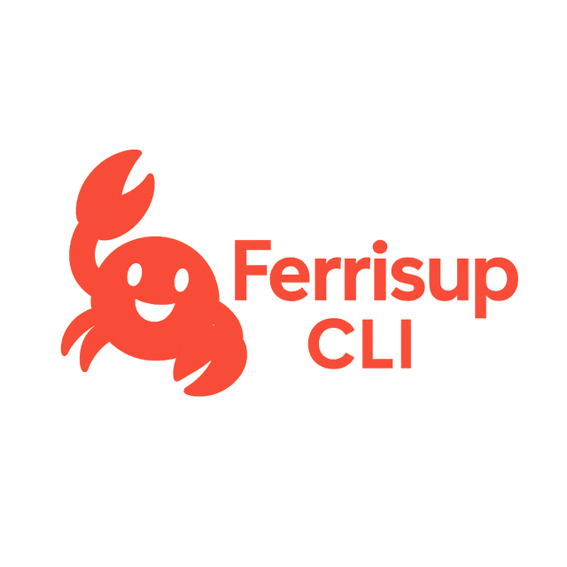

<p align="center">
  
</p>

# FerrisUp

FerrisUp is a command-line tool for starting Rust projects and evolving them as their architecture changes.

Website: [ferrisup.jitpomi.com](https://ferrisup.jitpomi.com)

It creates projects from bundled, inspectable templates; adds components to existing projects; converts a crate into a Cargo workspace; and assists with workspace and dependency maintenance. FerrisUp is not an AI framework and it does not generate application logic. It provides the predictable repository structure on which developers and coding agents can work.

## Why FerrisUp matters now

AI can produce code quickly, but speed does not guarantee a coherent codebase. Agents are more effective when package boundaries, framework choices, build commands, and workspace conventions are explicit. FerrisUp makes those decisions concrete in files that can be reviewed, compiled, versioned, and changed normally.

That gives a team:

- repeatable Rust project foundations instead of one-off generated layouts;
- less setup ambiguity for both people and coding agents;
- local templates whose dependencies and source code remain visible;
- a path from one crate to a multi-component Cargo workspace;
- automation-friendly project creation through non-interactive options.

FerrisUp complements AI-assisted development. It supplies structure and guardrails; the developer remains responsible for architecture, security, testing, and production readiness.

## What it supports

The current CLI exposes these component types:

- `minimal`: a small Rust binary;
- `library`: a Rust library crate;
- `embedded`: embedded project foundations;
- `server`: Axum, Actix Web, or Poem servers;
- `client`: Leptos projects plus delegated Dioxus and Tauri setup;
- `serverless`: provider-oriented function templates;
- `data-science`: Polars and Linfa-oriented projects;
- `edge`: static sites, API functions, and WebAssembly components;
- `shared`: a library intended for reuse inside a workspace.

Framework and provider availability varies by component. Run `ferrisup list`, use `ferrisup --help`, and preview a selection before generating it. Some specialized templates remain experimental and may require provider CLIs, target toolchains, or manual configuration.

## Install

Install the published crate:

```bash
cargo install ferrisup
```

Or install this checkout:

```bash
git clone https://github.com/Jitpomi/ferrisup.git
cd ferrisup
cargo install --path ferrisup
```

FerrisUp follows the stable Rust toolchain and its templates target Rust 2024 where their ecosystems support it. External frameworks and deployment targets may have additional requirements.

## Start a project

Use the interactive flow:

```bash
ferrisup new
```

Or make the selection explicit:

```bash
ferrisup new api --component-type server --framework axum --git
ferrisup new core --component-type library --no-interactive
ferrisup new analysis --component-type data-science --framework polars
```

FerrisUp refuses unsafe project names and will not generate over an existing destination.

Inspect a component without writing project files:

```bash
ferrisup preview --component-type server --framework axum
```

Preview is intentionally a summary. Complex framework output can differ from the final generated project.

## Evolve an existing project

Run the transformation flow from a Rust project or pass its path:

```bash
ferrisup transform
ferrisup transform --project ./my-project
```

The interactive workflow can convert a crate to a Cargo workspace, add a component, add a related project without converting to a workspace, update FerrisUp metadata, or show next steps. Commit or back up important work before structural transformations and review the resulting diff afterward.

Other maintenance commands include:

```bash
ferrisup component --help
ferrisup workspace --help
ferrisup dependency --help
ferrisup config --help
ferrisup unused-features --help
```

The CLI help is the source of truth for flags:

```bash
ferrisup --help
ferrisup new --help
```

## Repository layout

- `ferrisup/`: the CLI, embedded templates, integration tests, and detailed command documentation;
- `ferrisup_common/`: shared Cargo and filesystem utilities;
- `client/`: the optional Dioxus web client.

Visit the [FerrisUp website](https://ferrisup.jitpomi.com), or see [the CLI guide](./ferrisup/README.md), [template authoring guide](./ferrisup/docs/TEMPLATE_AUTHORING_GUIDE.md), [architecture notes](./ferrisup/docs/ARCHITECTURE.md), and [contribution guide](./ferrisup/CONTRIBUTING.md).

## Develop

```bash
cargo fmt --all --check
cargo test --workspace --all-targets
cargo clippy --workspace --all-targets
```

Some transformation integration tests are ignored because they exercise interactive or destructive filesystem workflows. See [testing guidance](./ferrisup/TESTING.md).

## License

FerrisUp is available under the [MIT License](./LICENSE).
