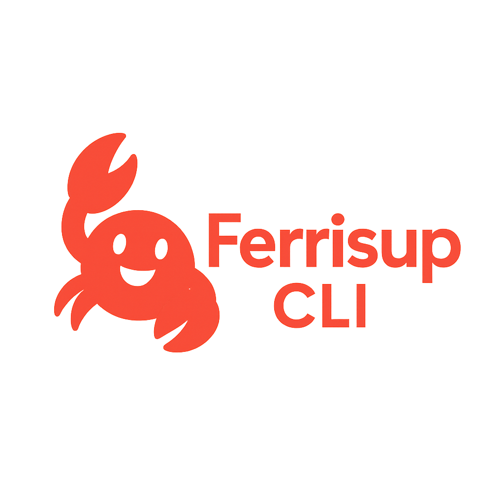

# FerrisUp CLI

A powerful Rust project bootstrapping tool - Start Anywhere, Scale Anywhere

> **Note:** FerrisUp is under active development. While the core templates are fully functional, some advanced features described in this README are still in development and will be included in upcoming versions.

## Overview

FerrisUp CLI is a versatile command-line tool for creating and managing Rust projects with flexible templates. Like Create React App for React, FerrisUp makes it easy to start new Rust projects with the right structure and dependencies.

## Features

- **Multiple Templates**: From minimal binaries to full-stack applications
- **Transform Capability**: Start with a simple project and scale as you grow
- **GenAI Integration**: Ready-made AI model templates
- **Edge Computing**: WebAssembly and serverless-ready templates
- **Embedded Systems**: Support for RP2040, ESP32, STM32, and Arduino
- **Interactive CLI**: User-friendly command interface

For full documentation, visit: https://github.com/Jitpomi/ferrisup
